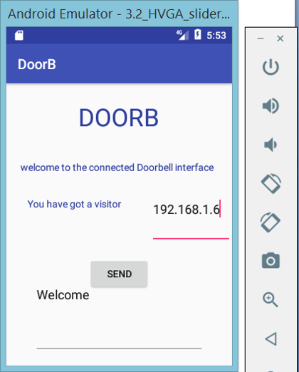
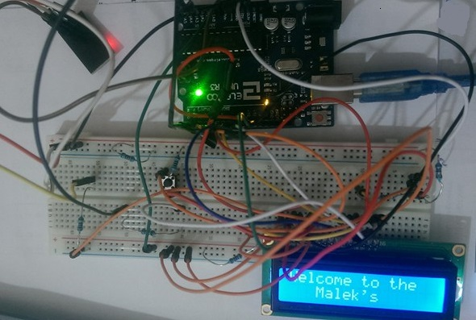

# Connected-Doorbell
Connected doorbell is a project allowing to link your door bell to your phone.
It enables you to recieve notifications on your phone when someone rings the doorbell and to send them a message 
which will be displayed on a led screen next to the door.

## Code structure

### The arduino script
* Displaying a welcome message to the screen when launched
* Sending 4 bits data to the android application when the button is pressed 
* Recieving a message from the application to be displayed to the screen
### The Android mobile application 
  

## Components used for this project: 
  
* Arduino board
* ESP8266 wifi module
* Push button 
* Led screen
* Bread board 
* smart phone
